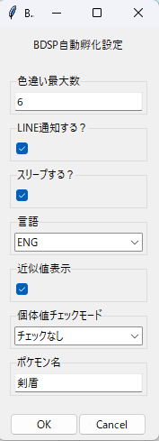
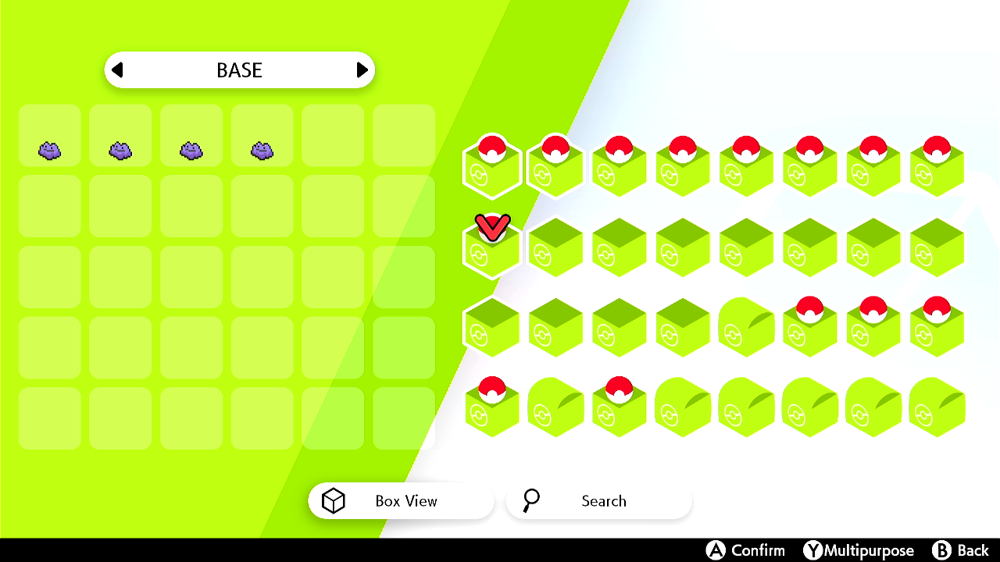
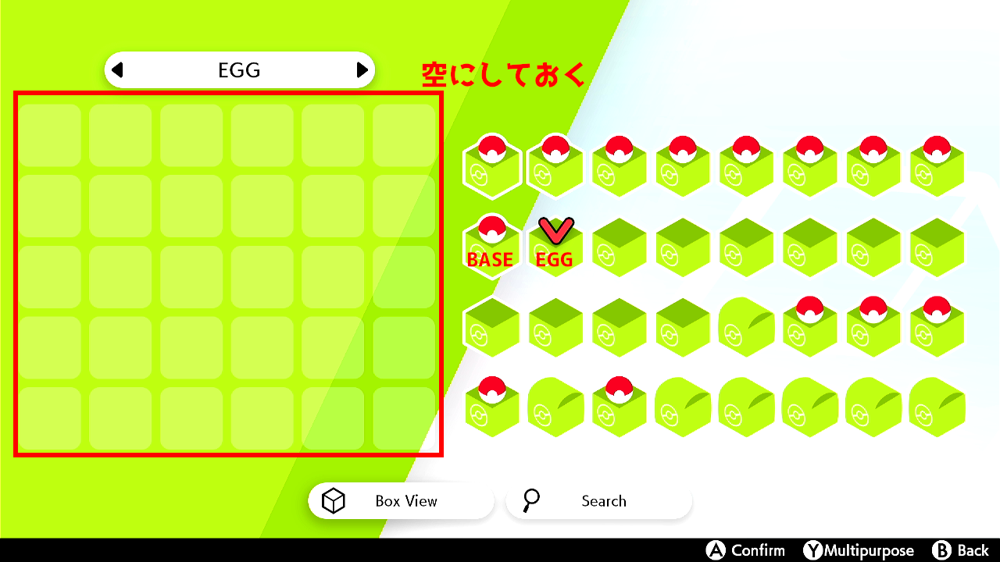
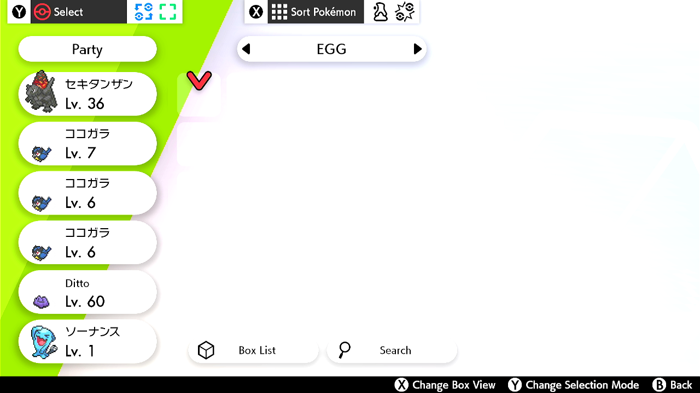

# SWSH_EggHatchingForPokeController

自動タマゴ孵化（色違いチェック）スクリプト（Pokémon Sword & Shield）  
本スクリプトは Poke-Controller 用の自動孵化ツールです。

## 概要
このリポジトリには 1 ボックス（30個）単位でタマゴ孵化と色違い判定を自動化するコマンドが含まれます。メイン実装は [`SWSH_Egg_1BOX`](SerialController/Commands/PythonCommands/SWSH_Egg_1BOX.py) クラスです。詳しい処理は以下のメソッドを参照してください。

- メイン実行: [`SWSH_Egg_1BOX.do`](SerialController/Commands/PythonCommands/SWSH_Egg_1BOX.py)  
- 設定ダイアログ: [`SWSH_Egg_1BOX.set_param`](SerialController/Commands/PythonCommands/SWSH_Egg_1BOX.py)  
- 孵化処理: [`SWSH_Egg_1BOX.hatching`](SerialController/Commands/PythonCommands/SWSH_Egg_1BOX.py)  
- 色違い判定: [`SWSH_Egg_1BOX.isShiny`](SerialController/Commands/PythonCommands/SWSH_Egg_1BOX.py)  
- 色違い発見時リセット: [`SWSH_Egg_1BOX.softReboot`](SerialController/Commands/PythonCommands/SWSH_Egg_1BOX.py)  
- 実行終了後スリープ移行: [`SWSH_Egg_1BOX.power_sleep`](SerialController/Commands/PythonCommands/SWSH_Egg_1BOX.py)

## 紹介動画（1サイクル解説動画）
1サイクル分の動作の解説をしてます。こちらのREADMEと合わせてご確認ください。

## 処理概要（簡易フロー）
1. 実行環境確認（Poke-Controller Modified/Extension 判定）  
2. ダイアログでパラメータを設定（色違い上限、LINE 通知、言語など）  
3. 育て屋でタマゴを受け取る → 孵化場へ移動  
4. 走らせて孵化判定（色違いを検出したら通知・リセット）  
5. 孵化済みポケモンをボックス操作で戻す/逃がす → サイクルを繰り返す  
（詳細は上記メソッド参照）

## 開始前の準備
1. Poke-Controller Modified または Extension が動作する環境を用意する（実行環境は [`SWSH_Egg_1BOX.judgePokeConEdition`](SerialController/Commands/PythonCommands/SWSH_Egg_1BOX.py) で判定）。  
2. Switch と Poke-Controller（シリアル/USB）を接続する。  
3. カメラ/映像入力を接続し、画面表示がテンプレート画像と一致するように配置する。テンプレートは下記フォルダを使用：
   - [SerialController/Commands/Template/SWSH/EGG_Util/ENG/](SerialController/Commands/Template/SWSH/EGG_Util/ENG/)  
   - [SerialController/Commands/Template/SWSH/EGG_Util/JPN/](SerialController/Commands/Template/SWSH/EGG_Util/JPN/)  
4. 説明用画像（手順確認用）をプロジェクトの `expImg/` に置く（例: `expImg/step1.png` ～ `expImg/step4.png`）。

## 使用方法（概略）
1. Poke-Controller の UI からコマンド名「SWSH 色違い孵化 1BOX」を選択して実行（表示名はクラスの NAME 属性）。  
2. ダイアログでパラメータを設定（色違い上限数・言語・LINE 通知など）。
- ダイアログの項目にある「個体値チェックモード」では、以下のモードを選べます。

モード名 | 個体値（H-A-B-C-D-S）
---|---
チェックなし | 個体値確認しません。
6V | 31-31-31-31-31-31
A0-5V | 31-0-31-31-31-31
C0-5V | 31-31-31-0-31-31
S0-5V | 31-31-31-31-31-0
AS0-4V | 31-0-31-31-31-0
CS0-4V | 31-31-31-0-31-0

- 言語は現在「ENG」「JPN」のみ対応しています。

3. 実行中はカメラ映像とテンプレート認識の状態を確認し、必要に応じてテンプレートを更新。

## 開始前チェックリスト
- [ ] Switch の画面とテンプレートの表示が一致している  
- [ ] カメラの角度・解像度が固定されている  
- [ ] テンプレート画像が `SerialController/Commands/Template/SWSH/EGG_Util/` にある  
- [ ] 必要なら LINE トークン等の設定を済ませる（LINE 通知を利用する場合）

## 前提条件
以下の準備をしておくこと。

1. 特定のボックス名の命名と配置
- 卵をボックスに送るために手持ちを埋める要員を配置する「きじゅん」ボックス、卵を配置する「たまご」ボックス、色卵や理想個体を格納する空きボックスの3つを用意します。「きじゅん」ボックスと「たまご」ボックスの言語別命名は以下の通りです。

言語 | きじゅん | たまご
---|---|---
JPN | きじゅん | たまご
ENG | BASE | EGG

- 各ボックスは9,10,11番目に配置してください。

2. 手持ちを埋めておく
- 最初に卵の受け取りから始まるため、手持ちを埋めてください。

3. メニュー画面でマップと手持ちを同じ行に配置する（推奨）
- メニュー機能を選択する際、同じ行に配置すると探索が最小限で済みます。時短になります。

  
  
  

## 参照ファイル
- コマンド本体: [SerialController/Commands/PythonCommands/SWSH_Egg_1BOX.py](SerialController/Commands/PythonCommands/SWSH_Egg_1BOX.py)  
- テンプレート: [SerialController/Commands/Template/SWSH/EGG_Util/ENG/](SerialController/Commands/Template/SWSH/EGG_Util/ENG/) / [SerialController/Commands/Template/SWSH/EGG_Util/JPN/](SerialController/Commands/Template/SWSH/EGG_Util/JPN/)  
- 説明画像フォルダ: [expImg/](expImg/)
- 参考フォルダ（ライン通知設定について）： [参考](参考/)
- この README: [README.md](README.md)

## ライン通知設定について
本プログラムではライン通知によって色違いの報告や孵化数の定期報告をさせています。
ライン通知のモジュールを無理やりディスコード通知版に変更するためのソースコードや解説は[参考](参考/)フォルダのファイルをご確認ください。

## 注意事項
- 画面フォントや解像度がテンプレートと異なると認識精度が下がります。テンプレート画像は実機で再キャプチャして調整してください。  
- 長時間稼働するため、電源と接続の安定を確保してください。  
- 本スクリプトは改変された Poke-Controller（Modified/Extension）を想定しています。純正版では動作しない可能性があります。

---
最後に、必要なら英語版やトラブルシュート、テンプレート作成手順を追加します。
